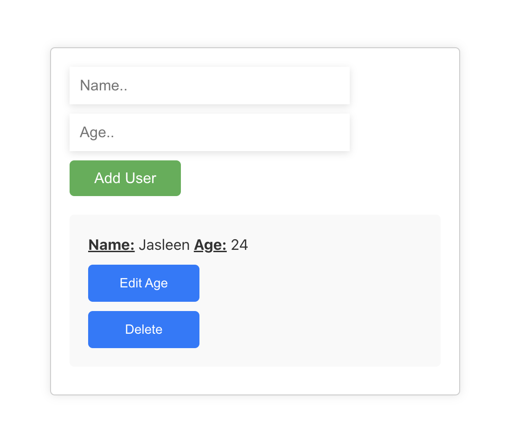

# Firebase CRUD App

A simple CRUD application built using React and Firebase, allowing users to add, view, update, and delete user information from a Firebase Firestore database.

## Table of Contents

- [Features](#features)
- [Prerequisites](#prerequisites)
- [Getting Started](#getting-started)
- [Usage](#usage)
- [Firebase Configuration](#firebase-configuration)
- [Screenshots](#screenshots)

## Features

- **Create:** Add new users with their names and ages to the database.
- **Read:** View the list of users with their names and ages.
- **Update:** Modify existing user information.
- **Delete:** Remove users from the database.

## Prerequisites

Before you begin, ensure you have the following installed:

- Node.js: [Download and Install Node.js](https://nodejs.org/)
- Firebase Account: Create a Firebase project at [Firebase Console](https://console.firebase.google.com/)

## Getting Started

1. **Clone the repository:**

   ```
   git clone https://github.com/Jasleenkaur1998/firebase-crud.git
    ```

2. Change into the project directory
3. Install dependencies:

   ```
   npm install
   ```

## Usage:

1. Start the development server:
    ```
    npm start
    ```
This will run the app in the development mode. Open http://localhost:3000 to view it in your browser.

Use the app to add, view, update, and delete user information.

## Firebase Configuration
Before running the app, configure your Firebase project:

1. Create a Firebase project in the Firebase Console.
2. Obtain your Firebase configuration object from the Firebase project settings.
3. Replace the configuration object in src/firebase-config.js with your own Firebase configuration.

## Screenshots:

